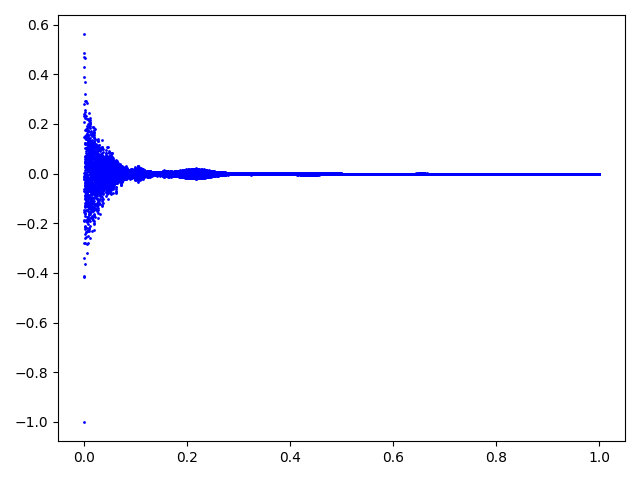
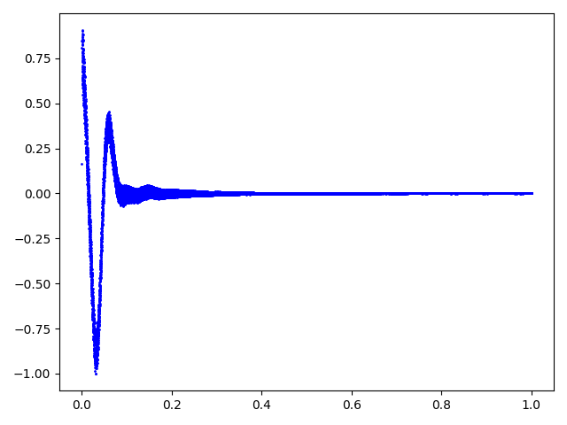

# FID to .wav
**Have you ever wanted to _hear_ molecules?** We created a simple tool to convert the outcoming signal 
from an NMR Spectrometer (Nuclear Magnetic Resonance) to an audible audio file. 
The code accepts the standard Agilent/Varian fid and procpar files and can output both the XY-matrix as a .csv file or directly a 16-bit, 44.1kHz .wav audio file.




## Usage

1) Open a shell window and clone the project.
    ```bash
    $ git clone https://github.com/mstrocchi/fid-to-wav.git
    ```

2) Put your FID files into the `resources` directory.

3) Get into the project's directory.
    ```bash
    $ cd fid-to-wav
    ``` 

4) Install the required packages.
    ```bash
    $ pip install -r requirements.txt 
    ``` 
5) Change the name of `DIR` variable at the top of `fid-to-wav.py` to the name of directory you just added.

6) Make `fid-to-wav.py` executable.
    ```bash
    $ chmod +x fid-to-wav.py
    ```

7) Run it.
    ```bash
    $ python fid-to-wav.py
    ```
   
#### You're done!


## Authors

- **Mattia Strocchi** - [m.strocchi@student.tudelft.nl](mailto:m.strocchi@student.tudelft.nl) 
- **Nicolò Tampellini** - [nicolo.tampellini@studio.unibo.it](mailto:nicolo.tampellini@studio.unibo.it) 