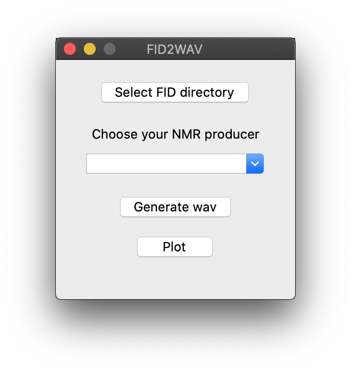
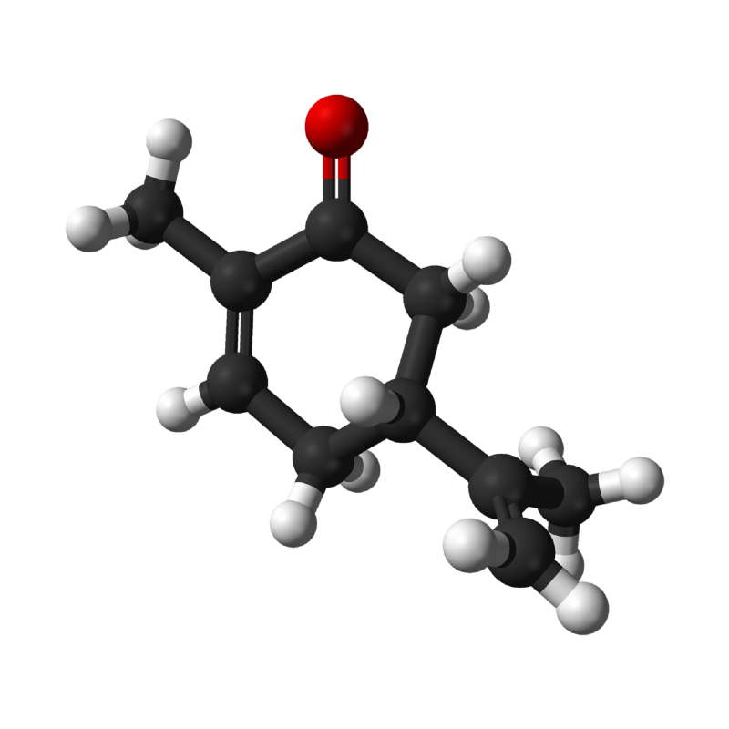
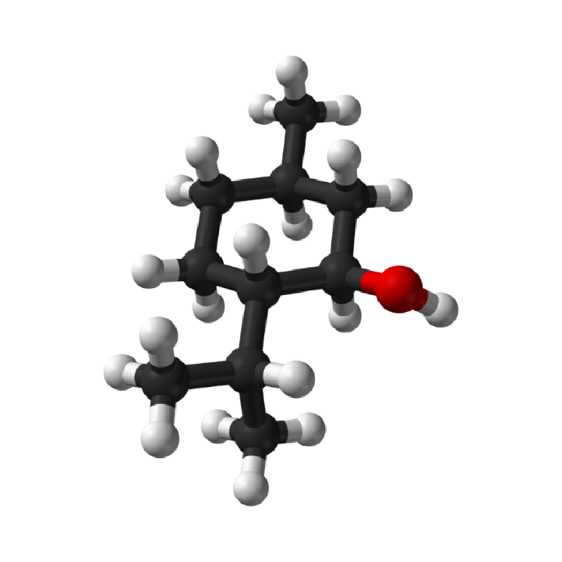
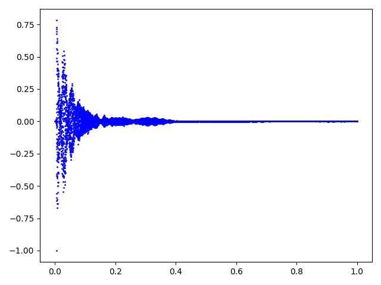
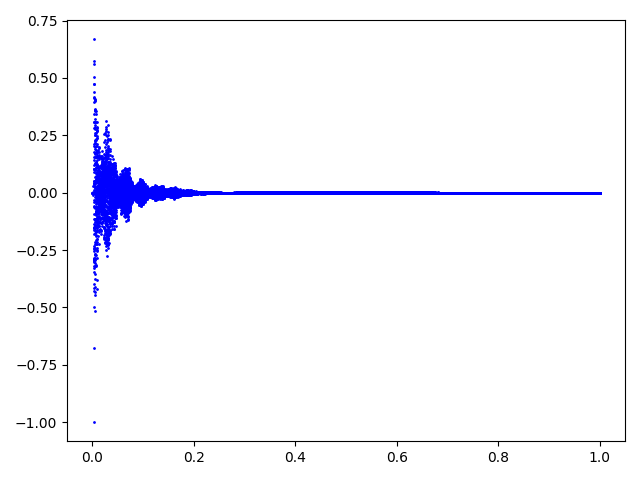

# FID-2-WAV

<div align="center">


[](https://opensource.org/licenses/MIT)

</div>

**Have you ever wanted to _hear_ molecules?** Here is a simple tool to convert the signal 
coming out from an Nuclear Magnetic Resonance (NMR) spectrometer to an audible file. 
The tool accepts raw FID files produced by Agilent, Bruker or Varian machines and outputs a `sound.wav` 
file associated to the molecule. 



## Here are two sound samples of (fairly) similar molecules 

| **(R)-Carvone** | **(-)-Menthol** |
:------------:|:-----------:|
 |  
 | 
 | 


## Requirements

The project uses .
To run the project from sources you will need  
and .

## Usage

1) Open a shell window and clone the project.
    ```bash
    $ git clone https://github.com/mstrocchi/fid-2-wav.git
    ```

2) Get into the project's root.
    ```bash
    $ cd fid-2-wav
    ``` 

3) Put the directory containing your FID raw files into `/resources`.

4) Install the required packages.
    ```bash
    $ pip install -r requirements.txt 
    ``` 

5) Run it with Python 3.
    ```bash
    $ python fid-2-wav.py
    ```
   
#### You're all set!


## Authors

- **Mattia Strocchi** - [m.strocchi@student.tudelft.nl](mailto:m.strocchi@student.tudelft.nl) 
- **Nicolò Tampellini** - [nicolo.tampellini@studio.unibo.it](mailto:nicolo.tampellini@studio.unibo.it) 

## License

**FID2WAV** is available under the MIT license. See the [LICENSE](https://github.com/mstrocchi/fid-2-wav/blob/master/LICENSE.md) file for more info.